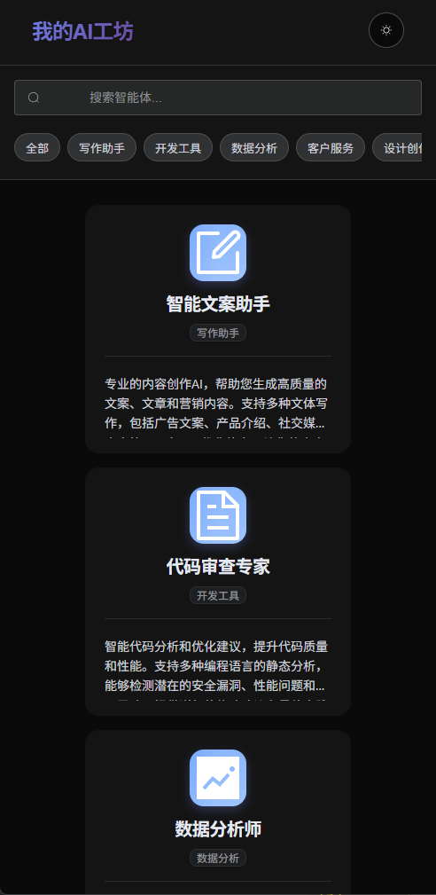

# 我的AI工坊 🤖

一个精美的AI智能体展示平台，基于Vue 3 + Element Plus构建，提供响应式设计和现代化的用户界面。


## ✨ 特性

- 🎨 **现代化设计** - 精美的正方形卡片布局，支持悬停动效
- 🌓 **主题切换** - 支持浅色/深色主题，状态持久化
- 📱 **响应式布局** - 完美适配桌面端、平板和移动端
- 🔍 **智能搜索** - 实时搜索和分类筛选功能
- ⚡ **高性能** - 基于Vue 3 Composition API和Vite构建
- 🎯 **易于使用** - 点击卡片直接跳转到Dify智能体页面

## 🖥️ 在线预览

[查看演示](https://your-demo-url.com) | [项目截图](https://github.com/chen-banxia/dify-application-sample/blob/master/screenshots/desktop-dark.png)

## 🚀 快速开始

### 环境要求

- Node.js >= 16.0.0
- npm >= 8.0.0

### 安装

```bash
# 克隆项目
git clone https://github.com/your-username/dify-application-sample.git
cd dify-application-sample

# 安装依赖
npm install

# 启动开发服务器
npm run dev
```

访问 [http://localhost:5173](http://localhost:5173) 查看项目。

## 📦 构建与部署

```bash
# 构建生产版本
npm run build

# 预览构建结果
npm run preview
```

构建完成后，所有文件将输出到 `dist` 目录。

## 🛠️ 技术栈

- **框架**: Vue 3 (Composition API + `<script setup>`)
- **UI库**: Element Plus
- **状态管理**: Pinia
- **路由**: Vue Router 4
- **构建工具**: Vite
- **样式**: CSS3 (CSS变量 + Flexbox + Grid)
- **语言**: JavaScript (ES6+)

## 📁 项目结构

```
src/
├── components/          # 组件目录
│   ├── AppHeader.vue   # 应用头部 (Logo + 主题切换)
│   ├── AgentCard.vue   # 智能体卡片组件
│   └── SearchFilter.vue # 搜索筛选组件
├── stores/             # Pinia状态管理
│   ├── agents.js       # 智能体数据管理
│   └── theme.js        # 主题状态管理
├── data/               # 数据文件
│   └── agents.json     # 智能体数据配置
├── views/              # 页面组件
│   └── HomeView.vue    # 首页
├── assets/             # 静态资源
│   └── main.css        # 全局样式 (主题变量)
├── router/             # 路由配置
│   └── index.js
└── main.js             # 应用入口文件
```

## ⚙️ 配置说明

### 智能体数据

编辑 `src/data/agents.json` 文件来管理智能体数据：

```json
{
  "id": 1,
  "name": "智能体名称",
  "description": "详细描述...",
  "icon": "ElementPlus图标名",
  "category": "分类",
  "difyUrl": "https://dify.ai/app/xxxx",
  "features": ["特性1", "特性2"],
  "rating": 4.8,
  "users": 1200
}
```

### 主题配置

主题系统使用CSS变量实现，支持：
- 自动检测系统偏好
- 手动切换主题
- 状态持久化存储

## 🚀 部署指南

### Nginx部署

详见 [docs/nginx.conf](./docs/nginx.conf) 配置文件。

### Docker部署

```bash
# 构建镜像
docker build -t my-ai-workshop .

# 运行容器
docker run -d -p 80:80 my-ai-workshop
```

### Vercel部署

[](https://vercel.com/new/clone?repository-url=https://github.com/your-username/dify-application-sample)

## 🎨 截图

### 桌面端 - 浅色主题


### 桌面端 - 深色主题  


### 移动端


## 🤝 贡献

欢迎提交 Issue 和 Pull Request！

1. Fork 项目
2. 创建功能分支 (`git checkout -b feature/AmazingFeature`)
3. 提交更改 (`git commit -m 'Add some AmazingFeature'`)
4. 推送到分支 (`git push origin feature/AmazingFeature`)
5. 创建 Pull Request

## 📄 开源协议

本项目采用 [MIT](LICENSE) 协议。

## 🙏 致谢

- [Vue.js](https://vuejs.org/) - 渐进式JavaScript框架
- [Element Plus](https://element-plus.org/) - 基于Vue 3的组件库
- [Vite](https://vitejs.dev/) - 下一代前端构建工具
- [Dify](https://dify.ai/) - AI应用开发平台

## 📞 联系方式

如有问题或建议，请通过以下方式联系：

- 📧 Email: your-email@example.com
- 🐛 Issues: [GitHub Issues](https://github.com/your-username/dify-application-sample/issues)

---

⭐ 如果这个项目对您有帮助，请给一个Star支持一下！
